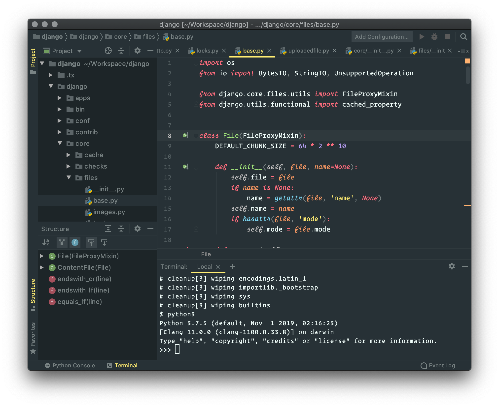
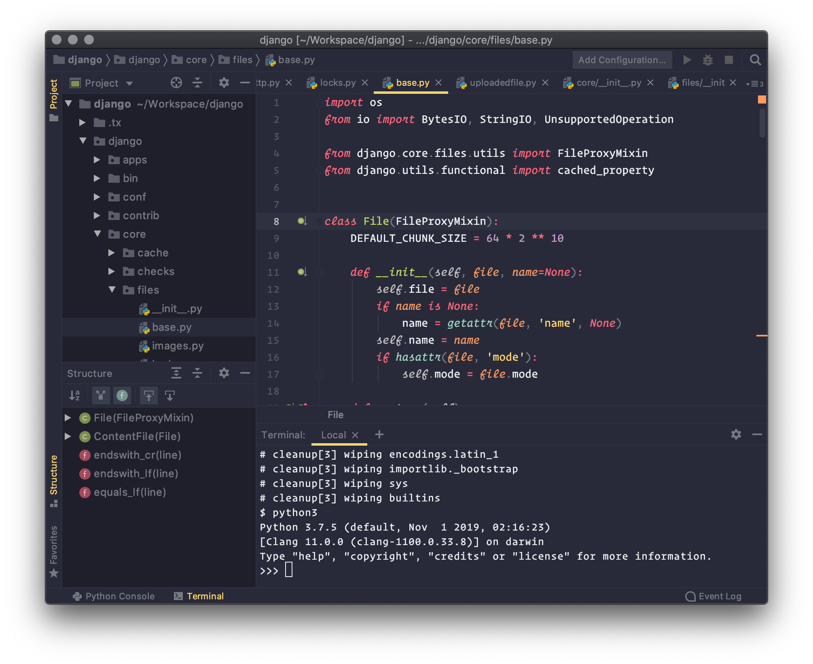

# Monokai Pro for JetBrains

This project is a faithful adaptation of the Monokai Pro theme for JetBrains, including all available filters. Credit for the theme goes to the original creator: https://monokai.pro.

## Screenshots

#### Monokai Pro:


#### Filter Machine:



#### Filter Octagon:



#### Filter Ristretto:


#### Filter Spectrum:


## Development

The colors were originally pulled from the Monokai Pro theme from the Material plugin, and modified to better match the official versions of Monokai Pro on Sublime and VSCode. I also updated the theme to use a handful of base colors I could match with known colors used in iTerm and Sublime/VSCode. 

To create the filters, I created a script that maps the default colors to the filter colors, and replaces each value. Whenever the default them is modified, the script should be run to update the filters:

```python
python filters.py
```
